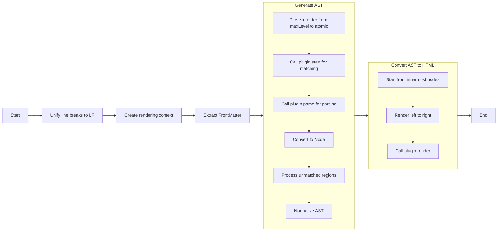

[简体中文](readme.zh-CN.md) | [English](readme.md)
# ezal-markdown


A simple, asynchronous markdown renderer.

## Installation
```sh
npm install ezal-markdown
# or
yarn add ezal-markdown
# or
pnpm add ezal-markdown
```

## Usage
```ts
import { EzalMarkdown } from 'ezal-markdown';

// Directly render Markdown text
EzalMarkdown.render(markdownText).then((result) => {
	const output = result.html; // Get the rendered HTML
});
// Create a renderer instance
const renderer = new EzalMarkdown();
renderer.render(markdownText).then((result) => {
	const output = result.html; // Get the rendered HTML
});
```

### Parsing FrontMatter

> [!NOTE]
> This feature requires optional dependency [yaml](https://www.npmjs.com/package/yaml) package.

```ts
import { EzalMarkdown, extractFrontmatter } from 'ezal-markdown';

// Parse Frontmatter separately
extractFrontmatter(markdownText).then((result) => {
	result.data; // Get parsed data
});

// Parse Frontmatter while rendering
EzalMarkdown.render(markdownText, { enableFrontmatter: true }).then((result) => {
	result.frontmatter.data; // Get parsed data
});
const renderer = new EzalMarkdown();
renderer.render(markdownText, { enableFrontmatter: true }).then((result) => {
	result.frontmatter.data; // Get parsed data
});
```

### Register Plugins
```ts
import { EzalMarkdown } from 'ezal-markdown';

// Register plugins globally (affects all instances)
EzalMarkdown.set(pluginA, pluginB);
// Register plugins for a specific instance (only affects that instance)
const renderer = new EzalMarkdown();
renderer.set(pluginA, pluginB);
```

## Build/Development
```sh
pnpm i
pnpm compile
pnpm test
```

## Documentation

### Plugins
Syntax in EzalMarkdown is implemented via plugins.

Plugins are categorized into three types:
- block: Block-level, parsed first (e.g., paragraphs, lists).
- inline: Inline-level (e.g., bold, links).
- atomic: Atomic-level, parsed last (e.g., plain text, line breaks).

### Built-in Plugins

Block Plugins:
| Name               | Priority | Description          |
| ------------------ | -------- | -------------------- |
| paragraph          | -2       | Paragraph (No parse) |
| blockquote         | 0        | Blockquote           |
| codeblock          | 0        | Indented code block  |
| codeblock-fenced   | 0        | Fenced code block    |
| footnote           | 0        | Footnote (source)    |
| heading            | 0        | ATX-style heading    |
| heading-underscore | 0        | Setext-style heading |
| hr                 | 0        | Horizontal rule      |
| image              | 0        | Image                |
| image-reference    | 0        | Image (reference)    |
| list-ordered       | 0        | Ordered list         |
| list-unordered     | 0        | Unordered list       |
| list-task          | 0        | Task list (GFM)      |
| table              | 0        | Table                |
| tex-dollar         | 0        | Tex `$$...$$`        |
| tex-bracket        | 0        | Tex `\[...\]`        |

Inline Plugins:
| Name            | Priority | Description                                |
| --------------- | -------- | ------------------------------------------ |
| bold            | 0        | Bold text                                  |
| italic          | 0        | Italic text                                |
| bold-italic     | 0        | Bold and italic text                       |
| del             | 0        | Strikethrough                              |
| code            | 0        | Inline code                                |
| footnote        | 0        | Footnote (reference)                       |
| image           | 0        | Image                                      |
| image-reference | 0        | Image (reference)                          |
| link            | 0        | Link                                       |
| link-source     | 0        | Link (source); also used for image sources |
| link-reference  | 0        | Link (reference)                           |
| link-bracket    | 0        | Autolink                                   |
| email-bracket   | 0        | Autolink for email                         |
| tex-dollar      | 0        | Tex `$...$`                                |
| tex-bracket     | 0        | Tex `\(...\)`                              |

Atomic Plugins:
| Name       | Priority | Description                                                |
| ---------- | -------- | ---------------------------------------------------------- |
| text       | -1       | Plain text (No parse, word count tracked during rendering) |
| break-hard | 0        | Hard line break                                            |
| break-soft | 0        | Soft line break                                            |
| escape     | 0        | Escape characters                                          |

### Shared Rendering Context
Built-in plugins create/use the following in the shared rendering context:
```ts
interface Shared {
	/** Footnote references */
	footnote: Record<string, string>;
	/** Link references */
	links: Record<string, { url: string, title?: string }>;
}
```

### Custom Plugins
```ts
interface Plugin<
	T extends NodeType,
	R extends TypeToParseResult<T> = TypeToParseResult<T>,
	C = never,
> {
	/** Name */
	name: string;
	/**
	 * Node type
	 * @description
	 * - `block`: Block node
	 * - `inline`: Inline node
	 * - `atomic`: Atomic node
	 */
	type: T;
	/**
	 * Priority
	 * @default 0
	 */
	priority?: number;
	/**
	 * Start position matcher
	 * @description
	 * - `StartMatcher`: Use a function to match; returns `-1 | null | undefined` if no match.
	 * - `string`: Matches the position of the string.
	 * - `RegExp`: Matches the position of the regex.
	 */
	start:
		| string
		| RegExp
		| ((
				source: string,
				context: PluginContext<C>,
		  ) => PromiseOr<number | RegExpMatchArray | null | undefined>);
	/** Parse */
	parse(
		source: string,
		context: PluginContext<C, this>,
	): PromiseOr<R | null | undefined | false>;
	/** Render */
	render(
		source: ParseResultToRenderSource<R>,
		context: PluginContext<C, this>,
	): PromiseOr<string>;
	/** Initialize plugin-specific context */
	context?: C extends never ? undefined : () => PromiseOr<C>;
}
```

### AST
EzalMarkdown renders Markdown text by parsing it into an AST and then converting it to HTML.

The AST root is an array of nodes `Node[]`, defined as follows:
```ts
type Children<T> = T | Children<T>[] | { [key: string]: Children<T> };

/**
 * Node type
 * @description
 * - `block`: Block node
 * - `inline`: Inline node
 * - `atomic`: Atomic node
 */
type NodeType = 'block' | 'inline' | 'atomic';

/** Base node */
interface BaseNode {
	/** Plugin name corresponding to the node */
	name: string;
	/** Node type */
	type: NodeType;
	/** Raw data of the node */
	raw: string;
	/** Custom data for the plugin corresponding to the node */
	data: object;
}

/** Atomic node */
interface AtomicNode extends BaseNode {
	/** Node type */
	type: 'atomic';
}

/** Inline node */
interface InlineNode extends BaseNode {
	/** Node type */
	type: 'inline';
	/** Child nodes */
	children: Children<AtomicNode | InlineNode>;
}

/** Block node */
interface BlockNode extends BaseNode {
	/** Node type */
	type: 'block';
	/** Child nodes */
	children: Children<Node>;
}
```

### Rendering Flow


Detailed rendering steps:
1. Preprocessing
   - Unify line breaks to LF format.
   - Create a rendering context (including utilities like Anchors, Toc, Counter).
   - Initialize plugin-specific contexts (if `context` is defined).
2. AST Generation
   - Parse from the highest level (`maxLevel`) to atomic level (`atomic`):
     1. Call `start` for all potential match positions.
     2. Traverse valid positions and call `parse` to parse content.
     3. Convert parsed results to AST nodes.
   - Process unmatched text regions (convert to `TextNode`).
   - Normalize AST:
     - Remove redundant line break nodes at boundaries.
     - Segment processing (if enabled).
     - Merge, replace, or remove redundant line break nodes.
3. HTML Generation
   - Traverse AST depth-first.
   - Start rendering from the innermost nodes, left to right.
   - Call `render` to generate HTML fragments.
   - Combine all fragments for the final HTML output.
