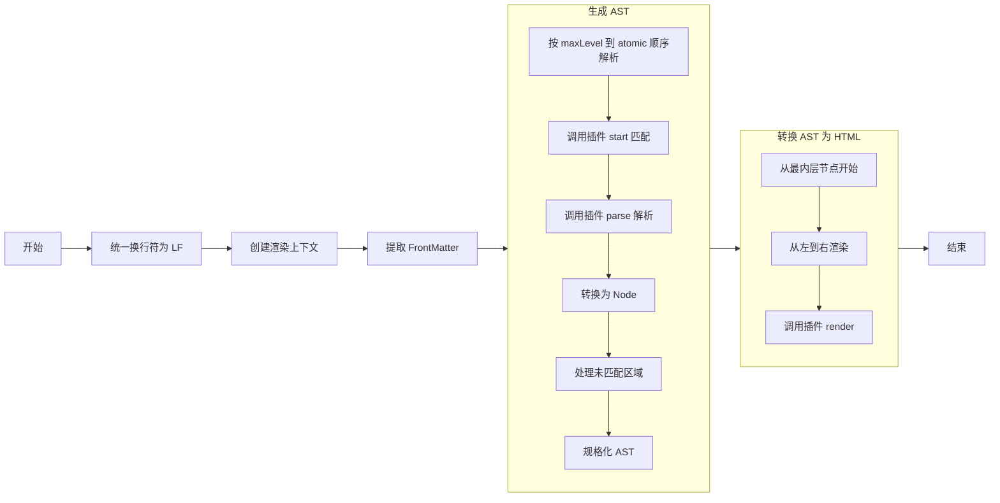

[简体中文](readme.zh-CN.md) | [English](readme.md)
# ezal-markdown


一个简单、异步的 markdown 渲染器。

## 安装
```sh
npm install ezal-markdown
# or
yarn add ezal-markdown
# or
pnpm add ezal-markdown
```

## 使用
```ts
import { EzalMarkdown } from 'ezal-markdown';

// 直接渲染 Markdown 文本
EzalMarkdown.render(markdownText).then((result) => {
	const output = result.html; // 获取渲染后的 HTML
});
// 创建渲染器实例
const renderer = new EzalMarkdown();
renderer.render(markdownText).then((result) => {
	const output = result.html; // 获取渲染后的 HTML
});
```

### 解析 FrontMatter

> [!NOTE]
> 此功能需要额外安装 [yaml](https://www.npmjs.com/package/yaml) 包（可选依赖）。

```ts
import { EzalMarkdown, extractFrontmatter } from 'ezal-markdown';

// 单独解析 Frontmatter
extractFrontmatter(markdownText).then((result) => {
	result.data; // 获取解析后的数据
});

// 渲染时同时解析 Frontmatter
EzalMarkdown.render(markdownText, { enableFrontmatter: true }).then((result) => {
	result.frontmatter.data; // 获取解析后的数据
});
const renderer = new EzalMarkdown();
renderer.render(markdownText, { enableFrontmatter: true }).then((result) => {
	result.frontmatter.data; // 获取解析后的数据
});
```

### 注册插件
```ts
import { EzalMarkdown } from 'ezal-markdown';

// 全局注册插件（所有实例都会生效）
EzalMarkdown.set(pluginA, pluginB);
// 为特定实例注册插件（仅对该实例生效）
const renderer = new EzalMarkdown();
renderer.set(pluginA, pluginB);
```

## 构建/开发
```sh
pnpm i
pnpm build
pnpm test
```

## 文档

### 插件
EzalMarkdown 中各语法通过插件实现。

插件分为三种类型：
- block：块级，最先解析（如段落、列表等）
- inline：行级（如加粗、链接等）
- atomic：原子，最后解析（如文本、换行等）

### 内置插件

块级插件：
| 名称               | 优先级 | 说明               |
| ------------------ | ------ | ------------------ |
| paragraph          | -2     | 段落（不解析内容） |
| blockquote         | 0      | 引用块             |
| codeblock          | 0      | 缩进式代码块       |
| codeblock-fenced   | 0      | 围栏代码块         |
| footnote           | 0      | 脚注（源）         |
| heading            | 0      | ATX 风格标题       |
| heading-underscore | 0      | Setext 风格标题    |
| hr                 | 0      | 水平线             |
| image              | 0      | 图像               |
| image-reference    | 0      | 图像（引用）       |
| list-ordered       | 0      | 有序列表           |
| list-unordered     | 0      | 无序列表           |
| list-task          | 0      | 任务列表（GFM）    |
| table              | 0      | 表格               |
| tex-dollar         | 0      | Tex `$$...$$`      |
| tex-bracket        | 0      | Tex `\[...\]`      |

行级插件：
| 名称            | 优先级 | 说明                     |
| --------------- | ------ | ------------------------ |
| bold            | 0      | 加粗                     |
| italic          | 0      | 斜体                     |
| bold-italic     | 0      | 加粗斜体                 |
| del             | 0      | 删除线                   |
| code            | 0      | 行内代码                 |
| footnote        | 0      | 脚注（引用）             |
| image           | 0      | 图像                     |
| image-reference | 0      | 图像（引用）             |
| link            | 0      | 链接                     |
| link-source     | 0      | 链接（源）；也作物图像源 |
| link-reference  | 0      | 链接（引用）             |
| link-bracket    | 0      | 自动链接                 |
| email-bracket   | 0      | 自动邮箱链接             |
| tex-dollar      | 0      | Tex `$...$`              |
| tex-bracket     | 0      | Tex `\(...\)`            |

原子插件：
| 名称       | 优先级 | 说明                             |
| ---------- | ------ | -------------------------------- |
| text       | -1     | 纯文本（不解析，渲染时统计字数） |
| break-hard | 0      | 硬换行                           |
| break-soft | 0      | 软换行                           |
| escape     | 0      | 转义字符                         |

### 共享渲染上下文
内置插件将会在共享渲染上下文中创建/使用以下内容：
```ts
interface Shared {
	/** 脚注引用 */
	footnote: Record<string, string>;
	/** 链接引用 */
	links: Record<string, { url: string, title?: string }>;
}
```

### 自定义插件
```ts
interface Plugin<
	T extends NodeType,
	R extends TypeToParseResult<T> = TypeToParseResult<T>,
	C = never,
> {
	/** 名称 */
	name: string;
	/**
	 * 节点类型
	 * @description
	 * - `block`：块节点
	 * - `inline`：行级节点
	 * - `atomic`：原子节点
	 */
	type: T;
	/**
	 * 优先级
	 * @default 0
	 */
	priority?: number;
	/**
	 * 匹配起始位置
	 * @description
	 * - `StartMatcher`：使用函数匹配，返回 `-1 | null | undefined` 表示未匹配
	 * - `string`：匹配字符串所在位置
	 * - `RegExp`：匹配正则表达式所在位置
	 */
	start:
		| string
		| RegExp
		| ((
				source: string,
				context: PluginContext<C>,
		  ) => PromiseOr<number | RegExpMatchArray | null | undefined>);
	/** 解析 */
	parse(
		source: string,
		context: PluginContext<C, this>,
	): PromiseOr<R | null | undefined | false>;
	/** 渲染 */
	render(
		source: ParseResultToRenderSource<R>,
		context: PluginContext<C, this>,
	): PromiseOr<string>;
	/** 初始化插件内上下文 */
	context?: C extends never ? undefined : () => PromiseOr<C>;
}
```

### AST
EzalMarkdown 通过解析 AST 后转换为 HTML 以渲染 Markdown 文本。

AST 根为节点数组 `Node[]`，节点定义如下：
```ts
type Children<T> = T | Children<T>[] | { [key: string]: Children<T> };

/**
 * 节点类型
 * @description
 * - `block`：块节点
 * - `inline`：行内节点
 * - `atomic`：原子节点
 */
type NodeType = 'block' | 'inline' | 'atomic';

/** 基础节点 */
interface BaseNode {
	/** 节点对应插件名称 */
	name: string;
	/** 节点类型 */
	type: NodeType;
	/** 节点原始数据 */
	raw: string;
	/** 节点对应插件的自定义数据 */
	data: object;
}

/** 原子节点 */
interface AtomicNode extends BaseNode {
	/** 节点类型 */
	type: 'atomic';
}

/** 行级节点 */
interface InlineNode extends BaseNode {
	/** 节点类型 */
	type: 'inline';
	/** 子节点 */
	children: Children<AtomicNode | InlineNode>;
}

/** 块级节点 */
interface BlockNode extends BaseNode {
	/** 节点类型 */
	type: 'block';
	/** 子节点 */
	children: Children<Node>;
}
```

### 渲染流程


详细渲染步骤：
1. 预处理
   - 统一换行符为 LF 格式
   - 创建渲染上下文（包括 Anchors、Toc、Counter 等工具类）
   - 初始化各插件的上下文（如果定义了 `context` 函数）
2. AST 生成
   - 从最高级别（`maxLevel`）到原子级别（`atomic`）逐级解析：
     1. 调用插件的 `start` 方法查找所有可能匹配的起点
     2. 遍历有效起点，调用插件的 `parse` 方法解析内容
     3. 将解析结果转换为 AST 节点
   - 处理未匹配的文本区域（转换为 `TextNode`）
   - AST 规格化：
     - 移除前后多余的换行节点
     - 分段处理（如果启用）
     - 合并、替换或移除多余的换行节点
3. HTML 生成
   - 深度优先遍历 AST
   - 从最内层节点开始，从左到右依次渲染
   - 调用各插件的 `render` 方法生成 HTML 片段
   - 组合所有片段得到最终 HTML 输出
